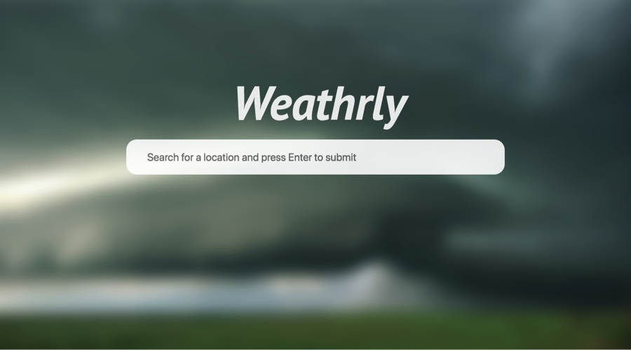
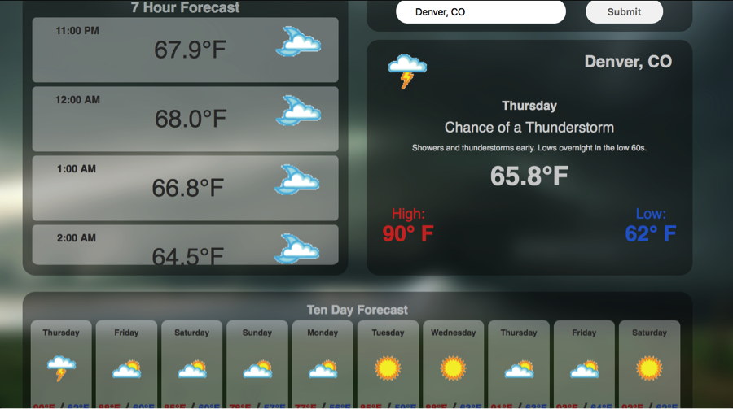

## Weathrly

Weathrly is a responsive weather application built with React.js and tested using Jest and Enzyme. This application utilizes Weather Underground's API to fetch and render weather forecast information from all around the world. It also includes an elegant User Interface that uses an autocomplete feature so that the user can easily search for a location.

### Getting Started:

  1. Clone down this repository.
  2. cd into the `weathrly` directory.
  3. `npm install`
  4. `npm start`

#### Contributors:

 * [Kurt Miller](https://github.com/kmiller9393)
 * [Alex Bruce](https://github.com/Alexbruce1)
